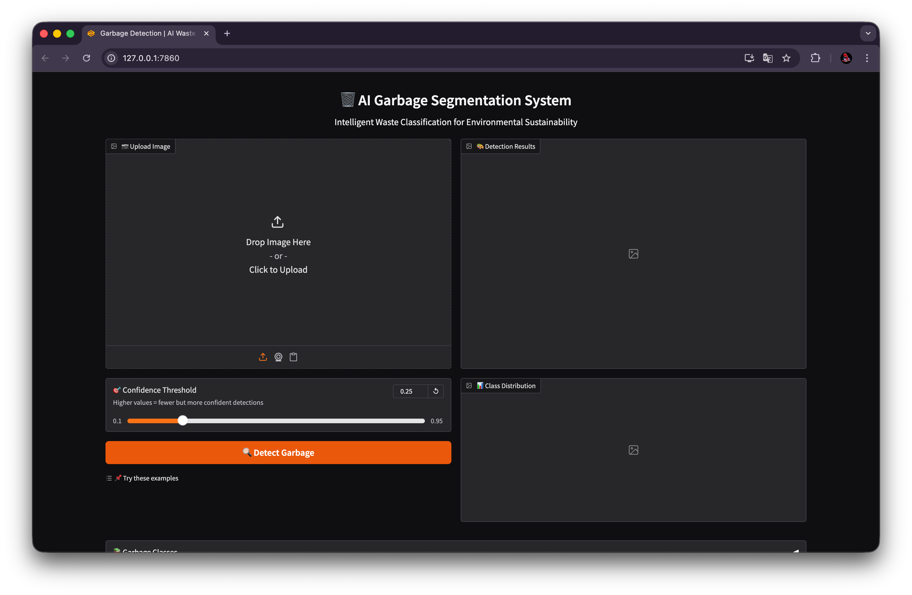
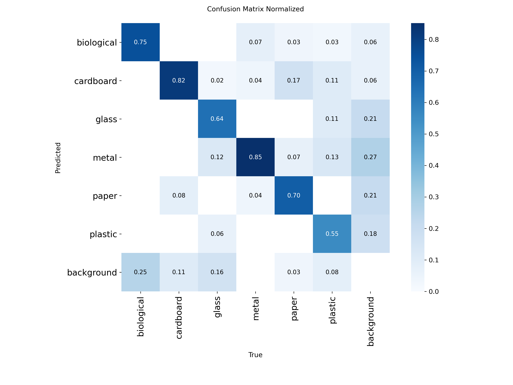
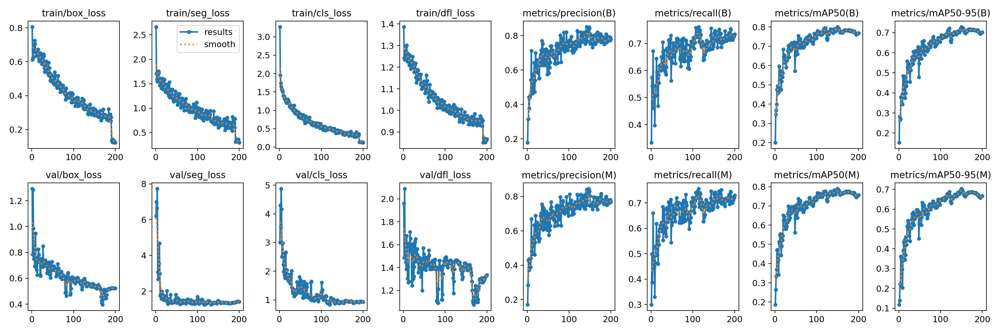
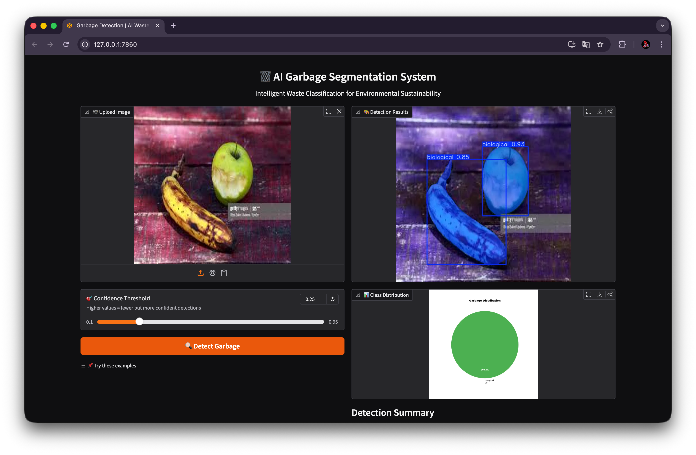

<div align="center">

# 🗑️ Garbage Classifier for Waste Management

**AI-Powered Garbage Segmentation & Classification System**

[](https://python.org)
[](https://ultralytics.com)
[](https://gradio.app)
[](LICENSE)

*An intelligent waste classification system using Deep Learning for smart waste management and environmental sustainability*



</div>

---

## 📋 Table of Contents

- [About the Project](#-about-the-project)
- [Features](#-features)
- [Tech Stack](#-tech-stack)
- [Dataset](#-dataset)
- [Model Architecture](#-model-architecture)
- [Installation](#-installation)
- [Usage](#-usage)
- [Results](#-results)
- [Team](#-team)
- [Acknowledgments](#-acknowledgments)

---

## 🎯 About the Project

Waste management is a critical global issue, and improper segregation of garbage contributes to pollution, health hazards, and inefficient recycling. Manual waste sorting is error-prone and labor-intensive.

This project presents an **intelligent Garbage Classifier for Waste Management** using Deep Learning techniques. The system employs:
- **YOLOv8** for detecting and segmenting garbage objects
- **MobileNetV2** for refined classification into six categories
- **Gradio** for a user-friendly web interface with real-time predictions

The expected outcome is a reliable and scalable solution that can support smart cities, recycling plants, and households in effective waste segregation, thereby promoting environmental sustainability.

---

## ✨ Features

| Feature | Description |
|---------|-------------|
| 🎯 **Instance Segmentation** | Precise pixel-level detection of garbage objects |
| 📊 **6-Class Classification** | Biological, Cardboard, Glass, Metal, Paper, Plastic |
| 🌐 **Web Interface** | User-friendly Gradio app for image uploads |
| 📈 **Visual Analytics** | Pie charts showing garbage distribution |
| ⚡ **Real-time Processing** | Fast inference on CPU/GPU |
| 🔧 **Adjustable Confidence** | Configurable detection threshold |

---

## 🛠️ Tech Stack

<table>
<tr>
<td align="center"><b>Category</b></td>
<td align="center"><b>Technologies</b></td>
</tr>
<tr>
<td>Deep Learning</td>
<td>PyTorch, YOLOv8 (Ultralytics), MobileNetV2</td>
</tr>
<tr>
<td>Computer Vision</td>
<td>OpenCV, PIL/Pillow</td>
</tr>
<tr>
<td>Web Interface</td>
<td>Gradio</td>
</tr>
<tr>
<td>Visualization</td>
<td>Matplotlib, NumPy</td>
</tr>
<tr>
<td>Data Source</td>
<td>Roboflow</td>
</tr>
</table>

---

## 📁 Dataset

| Property | Details |
|----------|---------|
| **Source** | [Roboflow Universe](https://universe.roboflow.com/projetannuel/garbage-segmentation-lt1hb) |
| **Total Images** | 481 |
| **Annotation Format** | YOLOv8 Segmentation |
| **Image Size** | 640×640 (resized) |
| **License** | CC BY 4.0 |

### Classes (6 Categories)

| Class | Description | Color |
|-------|-------------|-------|
| 🟢 **Biological** | Food waste, organic matter | Green |
| 🟤 **Cardboard** | Boxes, packaging | Brown |
| 🔵 **Glass** | Bottles, jars | Blue |
| ⚪ **Metal** | Cans, foils | Gray |
| 🟡 **Paper** | Documents, newspapers | Yellow |
| 🔴 **Plastic** | Bottles, bags, containers | Red |

---

## 🏗️ Model Architecture

```
┌─────────────────────────────────────────────────────────┐
│                    INPUT IMAGE                          │
└─────────────────────────┬───────────────────────────────┘
                          │
                          ▼
┌─────────────────────────────────────────────────────────┐
│              YOLOv8 SEGMENTATION MODEL                  │
│  • Object Detection (Bounding Boxes)                    │
│  • Instance Segmentation (Pixel Masks)                  │
│  • Primary Classification                               │
└─────────────────────────┬───────────────────────────────┘
                          │
                          ▼
┌─────────────────────────────────────────────────────────┐
│           OPTIONAL: MobileNetV2 CLASSIFIER              │
│  • Refined classification on cropped regions            │
│  • Higher accuracy for ambiguous cases                  │
└─────────────────────────┬───────────────────────────────┘
                          │
                          ▼
┌─────────────────────────────────────────────────────────┐
│                    GRADIO INTERFACE                     │
│  • Annotated image with masks & labels                  │
│  • Pie chart distribution                               │
│  • Detection summary                                    │
└─────────────────────────────────────────────────────────┘
```

---

## 🚀 Installation

### Prerequisites

- Python 3.8 or higher
- pip package manager
- (Optional) CUDA-compatible GPU for faster inference

### Setup

```bash
# Clone the repository
git clone https://github.com/YOUR_USERNAME/garbage-segmentation-app.git
cd garbage-segmentation-app

# Create virtual environment (recommended)
python -m venv venv
source venv/bin/activate  # On Windows: venv\Scripts\activate

# Install dependencies
pip install -r requirements.txt
```

### Download Model Weights

Download the trained model weights and place in `weights/` directory:

```bash
# Create weights directory
mkdir -p weights

# Download best.pt (link will be provided/you can train your own)
# Place the file as: weights/best.pt
```

> **Note**: Model weights (~90MB) are not included in the repository due to size. See `weights/README.md` for download instructions.

---

## 💻 Usage

### Launch Web Interface

```bash
python app.py
```

Then open your browser to `http://127.0.0.1:7860`

### Command Line Options

```bash
# Create public shareable link
python app.py --share

# Custom port
python app.py --port 8080

# Custom host
python app.py --host 0.0.0.0
```

### Python API

```python
from models import GarbageSegmentor

# Initialize model
segmentor = GarbageSegmentor()

# Run inference
results = segmentor.predict("path/to/image.jpg")

# Get annotated image
annotated = segmentor.visualize(results)

# Get detection summary
summary = segmentor.get_detection_summary("path/to/image.jpg")
print(f"Total objects: {summary['total_detections']}")
print(f"Classes: {summary['class_counts']}")
```

---

## 📊 Results

### Training Metrics

<div align="center">

| Metric | Value |
|--------|-------|
| Model | YOLOv8 Segmentation |
| Epochs | 100+ |
| Image Size | 640×640 |
| Batch Size | 16 |

</div>

### Confusion Matrix



### Training Curves



### Sample Detections



---

## 👥 Team

**Minor Project | 5th Semester | BTech (Hons.) CSE - Artificial Intelligence**  
**University Teaching Department (UTD), CSVTU Bhilai**  
**Group Number: 09**

<table>
<tr>
<td align="center"><b>Team Member</b></td>
<td align="center"><b>Contributions</b></td>
</tr>
<tr>
<td><b>Abhay Singh Sisoodiya</b></td>
<td>Model Development, Deployment (Gradio Web Interface)</td>
</tr>
<tr>
<td><b>Abhinav Anand</b></td>
<td>Data Collection (Roboflow Dataset), Documentation & Testing</td>
</tr>
<tr>
<td><b>Aditya Verma</b></td>
<td>Utilities (Preprocessing & Visualization), Deployment, Presentation</td>
</tr>
<tr>
<td><b>Anshul Yadav</b></td>
<td>Integration (Inference Pipeline)</td>
</tr>
<tr>
<td><b>Aman Banajre</b></td>
<td>Documentation & Testing (Report, README, Testing)</td>
</tr>
<tr>
<td><b>Harsh Kumar Chandrakar</b></td>
<td>Data Collection, Model Development, Integration</td>
</tr>
</table>

---

## 📁 Project Structure

```
garbage-segmentation-app/
├── app.py                  # Entry point for Gradio app
├── requirements.txt        # Python dependencies
├── .gitignore
├── LICENSE
├── README.md
│
├── models/                 # Core model code
│   ├── __init__.py
│   ├── yolo_segmentation.py
│   ├── mobilenet_classifier.py
│   ├── inference.py
│   ├── gradio_app.py
│   └── utils/
│       ├── preprocessing.py
│       └── visualization.py
│
├── weights/                # Model weights (download separately)
│   └── README.md
│
├── results/                # Training metrics & curves
│   ├── confusion_matrix.png
│   ├── results.png
│   └── ...
│
├── data/                   # Dataset documentation
│   └── README.md
│
├── docs/                   # Documentation
│   └── screenshots/
│
└── notebooks/              # Jupyter notebooks
```

---

## 🙏 Acknowledgments

- **[Ultralytics](https://ultralytics.com)** - YOLOv8 framework
- **[Roboflow](https://roboflow.com)** - Dataset hosting and annotation tools
- **[Gradio](https://gradio.app)** - Web interface framework
- **[CSVTU Bhilai](https://csvtu.ac.in)** - University Teaching Department

---

## 📄 License

This project is licensed under the MIT License - see the [LICENSE](LICENSE) file for details.

---

<div align="center">

**🌱 Supporting UN SDG 11: Sustainable Cities and Communities**

*Made with ❤️ by Group 09 | UTD CSVTU Bhilai*

</div>
